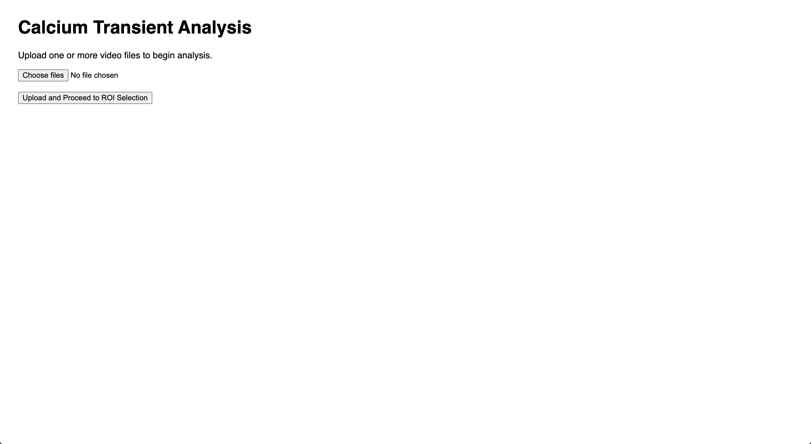
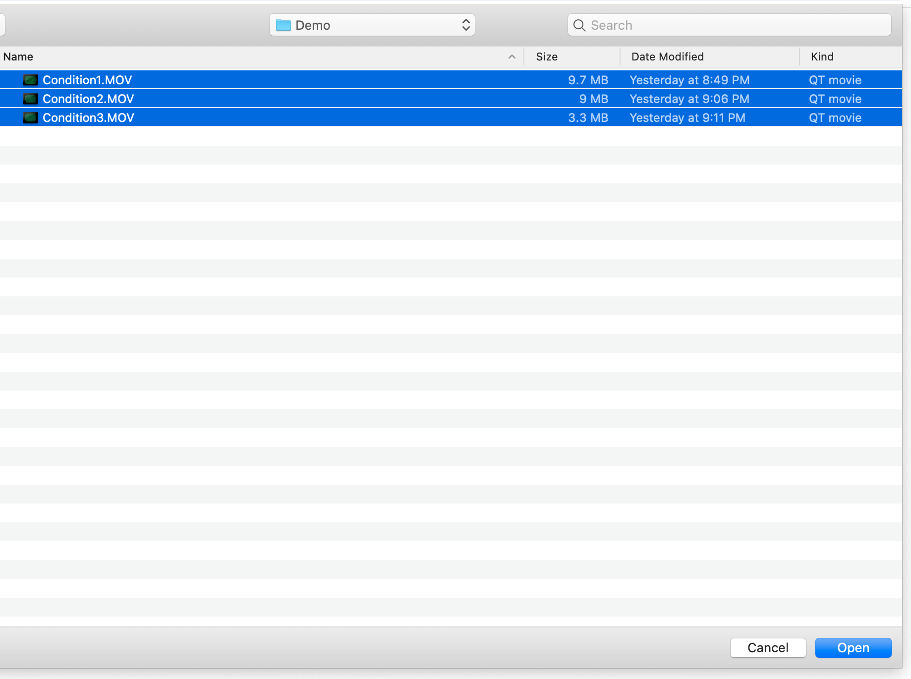
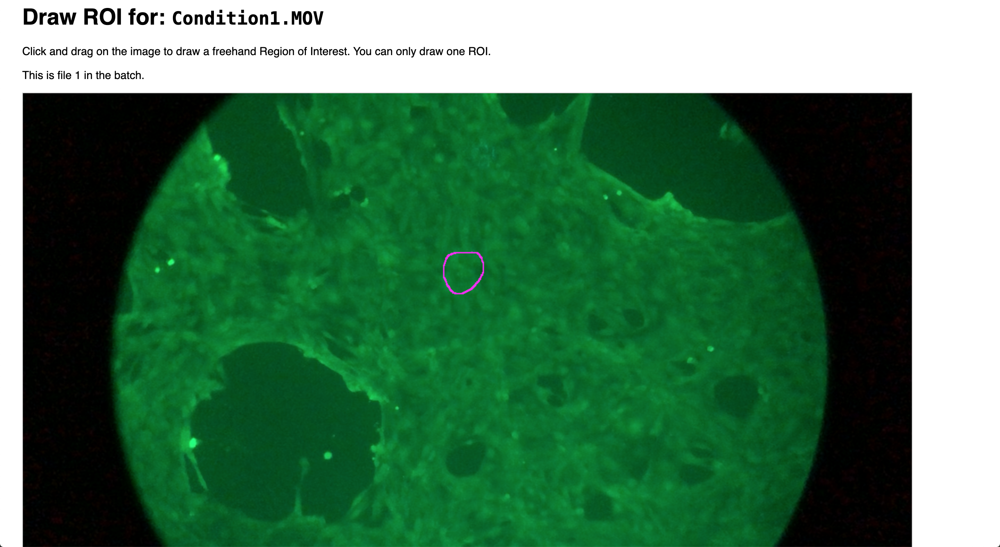

# Calcium Transient Analysis for PSC-Derived Cardiomyocytes

This repository provides a FastAPI application for analyzing calcium transients in video recordings of pluripotent stem cell (PSC)-derived cardiomyocytes. The interactive web interface allows users to upload one or more videos, select a region of interest (ROI), and process each video to extract and quantify calcium transient parameters.

## Features

- **Batch processing** of multiple video files (.mov, .mp4, .avi)  
- **Interactive ROI selection** via freehand drawing  
- **Quantification** of amplitude, rise time, decay times, decay rates, and fit quality  
- **Automated report** generation with plots and a combined CSV summary  

## Prerequisites

- Python 3.8 or higher  
- Git  

## Installation

1. **Clone the repository**  
   ```bash
   git clone https://github.com/wongchunka/caltransit
   cd calcium-transient-analysis
   ```

2. **Create and activate a virtual environment** (recommended)  
   ```bash
   python -m venv venv
   source venv/bin/activate    # On Windows: venv\Scripts\activate
   ```

3. **Install required packages**  
   ```bash
   pip install -r requirements.txt
   ```

## Usage

1. **Start the FastAPI server**  
   ```bash
   python run.py
   ```

2. **Open your browser** and navigate to `http://localhost:8000/`

3. **Upload one or more video files** (accepted formats: `.mov`, `.mp4`, `.avi`).




4. **Draw the ROI** on the first frame of each video by clicking and dragging. Only one ROI per video is supported.



5. **Process and proceed** to the next file. Once all videos are analyzed, you will be redirected to the results page.


## API Endpoints

- `GET /` : Landing page with upload form.  
- `POST /upload` : Accepts multipart form data (`video_files`), creates a batch session, and redirects to ROI selection.  
- `GET /batch/{batch_id}/{file_index}` : Interactive ROI selection page for each video in the batch.  
- `POST /process` : Receives JSON payload with `batch_id`, `file_index`, and `roi_points`. Processes the specified video and returns the next index or finalization.  
- `GET /results/{batch_id}` : Displays combined summary table and transient plots. Cleans up session data after rendering.  
- `GET /results/{batch_id}/{file_name}` : Serves individual result files (plots or CSV).  

## Output Format

All results are saved in the `results/{batch_id}/` directory:

- **`combined_results.csv`** : A CSV file summarizing each video’s transient parameters.  
- **`<video_stem>_transients_plot.png`** : Plots of raw vs. denoised signals and detected transient initiation points for each video.  

### `combined_results.csv` columns

| Column                            | Description                                                                    |
|-----------------------------------|--------------------------------------------------------------------------------|
| `Video Filename`                  | Base filename of the analyzed video (without extension)                        |
| `Beats per Minute`                | The number of calcium transient peaks detected per minute.                     |
| `Peak-to-Peak Duration (ms)`      | The average time between consecutive transient peaks in milliseconds.          |
| `Amplitude Ratio (Peak/Baseline)` | Mean ratio of peak intensity over baseline                                     |
| `Time to Peak (ms)`               | Average time from initiation to peak (milliseconds)                            |
| `Time to 50% Rise (ms)`           | Time to reach 50% of peak during rise phase (milliseconds)                     |
| `Time to 50% Decay (ms)`          | Time to decay to 50% of peak value (milliseconds)                              |
| `Time to 80% Decay (ms)`          | Time to decay to 80% of peak value (milliseconds)                              |
| `Time to 90% Decay (ms)`          | Time to decay to 90% of peak value (milliseconds)                              |
| `Time to Max Decay Rate (ms)`     | Time point at which the maximal decay rate occurs (milliseconds)               |
| `Max Decay Rate`                  | Magnitude of the maximal decay rate (intensity units per millisecond)          |
| `Decay Fit R-Squared`             | Coefficient of determination for the polynomial fit of the decay phase         |

## Project Structure

```
├── main.py                # FastAPI application code
├── requirements.txt       # Pin exact package versions (optional)
├── static/                # Static assets (frames for ROI selection)
├── uploads/               # Temporary storage for uploaded videos
├── results/               # Output directory for batch results
└── README.md              # This documentation
```

